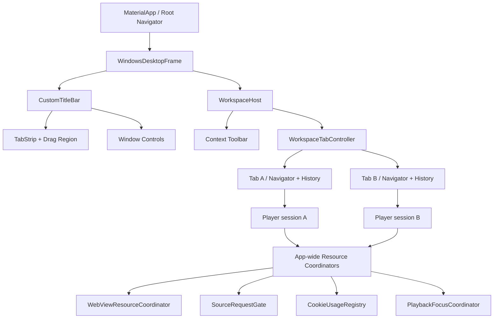

# Windows 自定义标题栏与多 Tab 工作区实施计划

> 状态：已确认的实施规划  
> 日期：2026-07-23  
> 首期范围：Windows 桌面端  
> 核心原则：先解决多播放器会话隔离和全局资源上限，再开放多 Tab UI；Tab 失活不等于页面销毁；任何全局清理都必须知道资源所有者。

---

## 0. 已确认的产品决策

| 主题 | 决策 |
|------|------|
| Windows 最小宽度 | 720 px；不在 600 px 处替换整个桌面工作区 |
| 播放页布局 | 720–900 px 使用桌面紧凑布局；大于 900 px 使用桌面宽屏布局 |
| Tab 默认导航 | 普通左键在当前 Tab 导航 |
| 新 Tab 操作 | `Ctrl+左键`或鼠标中键在新后台 Tab 打开；`+`创建新首页 Tab |
| 重复页面 | 不强制去重，允许相同动画、剧集存在于多个 Tab |
| 最后一个 Tab | 关闭后自动创建新的首页 Tab，不关闭应用窗口 |
| 后台播放 | 切换 Tab 后允许继续播放；另一个播放器开始播放时暂停原播放器 |
| 后台源搜索 | 已开始任务继续；排队任务降低优先级，不因切换 Tab 被取消 |
| 顶部结构 | 第一层为 Tab/窗口控制；第二层为导航和上下文操作 |
| NavigationRail | 只属于首页，不在详情页、播放页旁常驻 |
| 会话恢复 | 不恢复上次打开的 Tab；不做播放器重启恢复 |
| Win11 原生细节 | 暂不实现最大化按钮 Snap Layout 等完整非客户区体验 |

---

## 1. 背景与现状

### 1.1 当前窗口和导航

- Windows Runner 使用 `WS_OVERLAPPEDWINDOW`，当前由系统绘制标题栏。
- `MaterialApp` 只有一个根 `HomeScreen`，页面主要通过散落的 `Navigator.push` 打开。
- `PcHomeLayout` 已有自定义顶部区域和首页/索引/我的 `IndexedStack`，但它位于系统标题栏下方，且不是全局工作区。
- `HomeScreen` 当前在 600 px 处切换 `PcHomeLayout` / `MobileHomeLayout`。如果未来直接在该断点替换整个 Tab Shell，会卸载所有 Tab 子树。

### 1.2 当前播放器资源边界

- 每个 `PlayerPage` 自己创建 `Player`、WebView scheduler、worker widgets、搜索 controller 和各类订阅。
- 页面销毁时会停止播放器并清理自己的 scheduler；这一所有权边界应保留。
- `max_concurrent_webviews` 当前是**每个 PlayerPage 的局部上限**。多个播放页会把总 WebView 数量叠加。
- WebView2 environment、`CookieManager`、`SourceRequestGate` 是进程级共享状态。
- `SourceRequestGate` 当前按 `sourceName` 保留一个 latest-wins waiter。两个 PlayerPage 使用同一源时可能互相覆盖等待任务。
- Cookie 清理目前不知道 Player session 所有者。某个 PlayerPage 关闭或 worker 换源时，可能清理另一页面仍在使用的共享 host/cookie。

### 1.3 当前播放页 UI 模式问题

- 播放页只按宽度 `> 900` 判断 PC/移动布局。
- Windows 窄窗口会进入移动布局，同时把 `isMobile: true` 传给视频控件，从而启用移动端锁屏、亮度/音量手势等输入行为。
- 需要把“布局密度”和“输入平台”拆开，不能继续用同一个布尔值表示两件事。

---

## 2. 目标、非目标与硬性不变量

### 2.1 目标

1. Windows 隐藏系统标题栏，使用 Flutter 绘制的顶部区域承载 Tab 和窗口按钮。
2. 每个 Tab 有独立导航历史、滚动位置和页面状态。
3. 支持多个 PlayerPage 同时存在，且总 WebView 数量不超过应用级硬上限。
4. 关闭/返回一个 PlayerPage 只能释放该 Player session 的资源。
5. 切换 Tab 不销毁播放器；后台播放行为接近浏览器。
6. 保持 Android/iOS 现有导航和播放页行为不变。
7. 所有阶段可单独测试、回滚，避免一次性替换全局导航。

### 2.2 非目标

- 不实现 Win11 最大化按钮悬停 Snap Layout、完整 `WM_NCHITTEST` 非客户区行为。
- 不恢复上次打开的 Tab，不恢复播放器会话。
- 首期不把 Linux/macOS 切换到自定义标题栏或多 Tab；共享 UI 组件可以预留可移植性。
- 不重写播放器搜索、验证码、BT、弹幕、字幕业务逻辑。
- 不让不同 PlayerPage 使用独立 WebView2 用户数据目录；首期继续共享应用浏览器 profile。
- 不把 Dialog、BottomSheet 等临时交互改成 Tab。

### 2.3 硬性不变量

1. `liveWebViewWorkerCount <= appWideWebViewLimit` 对所有 Player session 始终成立。
2. worker 全局身份必须包含 `PlayerSessionId`；局部 `workerId` 不能单独作为全局键。
3. `closeSession(A)` 不得取消 B 的 gate waiter、任务、worker lease、cookie lease 或播放器。
4. Tab 失活只改变优先级和可见性，不触发 `PlayerPage.dispose()`。
5. 同一时间最多一个 Player session 持有播放焦点并输出音频。
6. 已分配给后台 session 的运行中 WebView job 不被抢占；只对尚未开始的任务重新排序。
7. host 仍被其他 session 使用时，不允许执行 host-wide cookie cleanup。
8. `Navigator.pop`、关闭 Tab 和关闭窗口都必须经过同一套 Player session 收尾协议。

---

## 3. 目标架构

### 3.1 身份层级

- `WorkspaceTabId`：一个顶层 Tab 的稳定内存身份。
- `WorkspaceRouteId`：Tab 内一条页面历史记录。
- `PlayerSessionId`：一个实际 `PlayerPage` State/route 实例的身份。
- `WebViewWorkerLeaseId`：至少由 `(playerSessionId, localWorkerId)` 组成。

`PlayerSessionId` 必须是 route 级而不是 tab 级。一个 Tab 的导航栈可能先后或同时保留多个 PlayerPage，例如“播放页 → 推荐详情 → 新播放页”。关闭 Tab 时关闭其中全部 session；返回一层时只关闭栈顶对应 session。

### 3.2 页面资源与全局协调器的边界

保持以下资源由 `PlayerPage`/Player session 持有：

- `media_kit Player` / `VideoController`
- `PlayerWebViewScheduler`
- `ReusableBrowserWorker` widget 和 runner
- 搜索 controller、stream subscriptions、scroll controller、notifier
- 当前页面的 WebView 状态、队列和 generation token

新增的全局服务只做跨 session 协调：

- `WebViewResourceCoordinator`：发放/回收带 owner 的 worker lease，维护硬上限和等待队列。
- `PlaybackFocusCoordinator`：决定哪个 session 可以播放；调用注册的 pause 回调，不持有 Player 对象。
- `CookieUsageRegistry`：记录 host/cookie 使用者并安全延迟清理。
- 改造后的 `SourceRequestGate`：共享同源冷却，但隔离不同 session 的 waiter。

全局协调器不得直接 dispose 某个页面的 widget。需要回收空闲 worker 时，只能通知 owner session 释放可回收的 idle slot；最终销毁仍由对应 widget tree 完成。

### 3.3 Tab 导航模型

每个 Tab 持有：

- 独立 navigator key；
- route/history entries 和当前位置；
- 当前标题、图标、是否播放音频、是否正在关闭；
- Tab 生命周期 participant registry；
- 前进/后退能力。

导航抽象使用 `WorkspaceNavigation`/context extension：

- 移动端继续调用现有 `Navigator`。
- Windows 普通点击向当前 Tab push。
- `Ctrl+左键`或中键创建后台 Tab。
- 页面仍可 `await` 当前 Tab 内 route 的返回结果。
- 新 Tab 导航不承诺返回 route result，调用点必须显式选择语义。

历史前进使用可重建的 `WorkspaceDestination` 描述。Player route 标记为重型 destination：从 Player 后退时正常 dispose；通过“前进”重新进入时创建全新 session，并从播放历史读取位置，不复用已销毁的 Player/WebView，也不视为应用重启恢复。

### 3.4 Player 可见性是两个维度

不能只使用“Tab 是否选中”判断播放器生命周期：

- `tabActive`：当前 Tab 是否在前台。
- `routeCurrent`：PlayerPage 是否是该 Tab 的栈顶 route。

最终状态由两者组合：

| 事件 | 播放 | WebView 搜索 | dispose |
|------|------|--------------|---------|
| 切到其他 Tab | 若持有播放焦点则继续 | 运行中继续，排队任务降级 | 否 |
| 回到该 Tab | 保持原状态 | 恢复前台优先级 | 否 |
| 同 Tab 内有新 route 覆盖 Player | 沿用当前行为：自动暂停，记录是否应恢复 | 运行中继续，排队任务降级 | 否 |
| 覆盖 route 返回 | 仅当此前由系统自动暂停时恢复 | 恢复相应优先级 | 否 |
| 另一个 Player 开始播放 | 原 Player 自动暂停并失去焦点 | 不直接取消搜索 | 否 |
| pop Player route | 保存进度、取消本 session、释放 lease | 取消本 session | 是 |
| 关闭整个 Tab | 依次 prepare-close Tab 内全部 session | 取消该 Tab 全部 session | 是 |
| 关闭应用 | 全部 session quiesce，设置超时兜底 | 全部取消 | 是 |

---

## 4. 分阶段实施计划

### Phase 0：基线、可观测性与安全网

**目的**：在改变资源边界前，先让多 session 问题能够被稳定复现和断言。

**状态（2026-07-23）**：已完成落地（identity + 可观测性 + 双 session 夹具 + 风险回归测试）。尚未改变资源硬上限或 gate/cookie 所有权语义。

#### 步骤

1. 为 PlayerPage、scheduler、worker、gate 和 cookie 日志补充 `tabId/sessionId/workerId/generation`。
2. 提取不依赖真实 WebView 的 session owner/value types。
3. 增加全局 debug invariant 快照：session 数、live worker 数、active job 数、pending waiter 数、cookie lease 数、当前播放焦点。
4. 建立两个 fake Player session 的组合测试夹具，不启动真实 WebView2。
5. 写出当前风险的回归测试：
   - 两个局部 scheduler 各取满上限时，总数会叠加；
   - 同源 gate waiter 当前会互相覆盖；
   - session A cleanup 不能影响 session B；
   - late callback 在 session 关闭后必须被 generation/owner guard 丢弃。

#### 落地路径（实现索引）

| 产物 | 路径 |
|------|------|
| Identity / lease 类型 | `lib/services/player_session/player_session_identity.dart` |
| Debug registry + snapshot | `lib/services/player_session/player_resource_debug.dart` |
| Gate pending 计数 / owner 日志 | `lib/services/source_request_gate.dart` |
| Cookie pending 计数 / owner 日志 | `lib/services/webview_cookie_janitor.dart` |
| Stats session 前缀 | `lib/services/webview_scheduler_stats.dart` |
| PlayerPage 注册 session | `lib/ui/pages/player_page.dart` |
| 双 session 夹具 | `test/support/fake_player_session.dart` |
| 风险回归 | `test/services/player_session/multi_session_phase0_risk_test.dart` |

#### 验收

- 新测试能覆盖两 session 同时搜索、关闭其中一个、另一个继续的序列。
- 日志中的任何 worker/job 都能追溯到唯一 Player session。
- 不改变单 PlayerPage 的现有运行行为。

---

### Phase 1：多 Player session 隔离与全局 WebView 配额

**目的**：先让“多个 PlayerPage 同时存在”在无 Tab UI 的情况下资源安全。

**状态（2026-07-23）**：已完成落地。Player session 关闭/换代会同步拒绝新任务并按 owner 取消等待；pool 与 legacy WebView 创建均受应用级 lease 硬上限约束；Gate waiter、Cookie host 使用与延迟清理均已按 session/generation 隔离。Tab/route 对 `prepareToClose()` 的统一 await 接入仍按 Phase 2 推进。

#### 落地路径（实现索引）

| 产物 | 路径 |
|------|------|
| Session 生命周期与有界关闭 | `lib/services/player_session/player_session_lifecycle.dart`、`lib/ui/pages/player_page.dart` |
| 应用级 WebView 配额/公平队列 | `lib/services/webview_resource_coordinator.dart` |
| widget dispose 后释放 lease | `lib/ui/widgets/webview_lease_boundary.dart` |
| pool/legacy 配额接入 | `lib/ui/pages/player/player_page_webview_scheduler_host.dart`、`player_page_webview_widgets.dart` |
| 多 session SourceRequestGate | `lib/services/source_request_gate.dart` |
| Cookie host lease / owner cleanup | `lib/services/cookie_usage_registry.dart`、`lib/services/webview_cookie_janitor.dart` |
| Phase 1 纯 Dart / widget 测试 | `test/services/webview_resource_coordinator_test.dart`、`source_request_gate_test.dart`、`webview_cookie_janitor_test.dart`、`test/ui/widgets/webview_lease_boundary_test.dart` |

#### 1.1 Player session 生命周期

1. 新增 `PlayerSessionId` 和 `PlayerSessionLifecycleState`：`created / active / background / closing / disposed`。
2. `PlayerPage` 创建时注册 session，dispose 时幂等注销。
3. 所有异步搜索、probe、captcha、video extraction callback 同时校验 session 和 generation。
4. 增加 `prepareToClose()`：
   - 禁止新任务入队；
   - 保存播放历史；
   - 取消该 session 的 pending waits/jobs；
   - 请求释放 worker leases；
   - 等待有界时间后允许 widget tree 卸载。
5. `dispose()` 继续作为最终兜底，但不能承担唯一的异步收尾入口。

#### 1.2 应用级 WebViewResourceCoordinator

1. 将 `max_concurrent_webviews` 重新定义为应用级 live WebView worker 硬上限，并更新设置页文案。
2. coordinator 维护：
   - 已注册 session 及前后台优先级；
   - 已发放的 worker leases；
   - 按 session 分组的等待请求；
   - foreground 优先、同优先级 round-robin 的公平队列。
3. pooled worker 和 legacy/non-pool 路径都必须在创建 WebView widget 前取得 lease，不允许调试开关绕过上限。
4. 新 session 请求资源而额度已满时：
   - 先通知其他 session 释放 disposable idle workers；
   - 不抢占正在运行的 captcha/video job；
   - 若仍无额度则排队。
5. worker widget 真正 dispose 后才释放 lease，避免“账面已释放、原生 WebView 尚存”造成瞬时超限。
6. session 关闭只调用 `releaseAllOwnedBy(sessionId)`，禁止全局 clear。
7. 运行时修改上限：
   - 增大时立即泵等待队列；
   - 减小时先回收 idle workers；
   - busy 数超过新上限时允许其自然完成，但禁止新建，并在 UI 标记 draining 状态。

#### 1.3 SourceRequestGate 多 session 化

1. pending key 从 `sourceName` 改为 `(sessionId, sourceName)`，保留每个 session 内 latest-wins。
2. `_lastStartedAt` 仍按 `sourceName` 全局共享，保持同源请求冷却。
3. `markStarted` 只处理对应 waiter，不得删除其他 session 的 waiter。
4. 增加 `cancelSession(sessionId)`；PlayerPage 不再调用影响其他页面的 `cancelAllPending()`。
5. 同一来源的多个 session 在冷却结束后进入公平队列，不同时猛发请求。

#### 1.4 Cookie 共享状态治理

1. 明确 WebView2 profile 和 CookieManager 继续全应用共享，挑战状态可跨 session 复用。
2. `CookieUsageRegistry` 记录 `(sessionId, host)` 和可证明由任务注入的精确 cookie keys。
3. 普通 Player session 关闭时：
   - 释放自己的 host lease；
   - 精确 cookie cleanup 只有在无其他使用者时执行或延迟；
   - 不执行无 owner 的 host-wide cleanup。
4. captcha 换源需要 host-wide cleanup 时，将请求放入延迟队列；只有该 host 没有活跃 session 时才执行。
5. 取消/替换 cleanup 请求必须带 owner/generation，避免旧 session 的延迟任务在新 session 启动后误执行。
6. 应用退出可统一 drain；超时则放弃清理，优先保证不误删运行中会话状态。

#### 验收

- 同时打开至少 3 个 PlayerPage，live WebView 数始终不超过全局设置值。
- A/B 同时访问同一 source 时 waiter 不丢失，并遵守全局冷却。
- 关闭 A 后，B 的运行中 job、排队任务、Cookie 和播放器不受影响。
- pool/legacy 两种模式都满足相同硬上限。
- 所有 coordinator 和隔离逻辑有纯 Dart 单测。

---

### Phase 2：播放焦点、route 可见性与统一关闭协议

**目的**：把“后台继续播放”和“最多一个音频源”的产品规则固化为可测试协议。

**状态（2026-07-24）**：已完成落地。所有 Player 播放入口与直接播放控件均接入应用级焦点仲裁；route 覆盖/恢复由全局 observer 驱动并排除播放器全屏 route；Player route pop 与应用退出均先 await 同一套有界 session 收尾协议，同时保留 DownloadManager 的退出保存。

#### 落地路径（实现索引）

| 产物 | 路径 |
|------|------|
| 应用级播放焦点仲裁 | `lib/services/playback_focus_coordinator.dart` |
| Workspace participant / Player session handle / shutdown | `lib/services/workspace_lifecycle.dart`、`windows/runner/flutter_window.cpp` |
| 全局 route visibility observer | `lib/services/workspace_route_observer.dart`、`lib/main.dart` |
| 异步 route close guard | `lib/ui/widgets/workspace_route_close_scope.dart`、`lib/ui/pages/player_page.dart` |
| Player open/play/focus 与 fullscreen 接入 | `lib/ui/pages/player_page.dart`、`lib/ui/pages/player/`、`lib/ui/widgets/video_player_controls.dart` |
| Phase 2 协议与 widget 测试 | `test/services/playback_focus_coordinator_test.dart`、`test/services/workspace_lifecycle_test.dart`、`test/ui/widgets/workspace_route_close_scope_test.dart` |

#### 步骤

1. 新增 `PlaybackFocusCoordinator`：
   - session 注册 pause callback 和播放状态 listenable；
   - Player 即将 `play/open autoplay` 前请求焦点；
   - 新 session 获得焦点时暂停旧 session；
   - tab 切换本身不释放焦点。
2. 加入 route visibility observer，替代散落的“push 前 pause、返回后 resume”特殊逻辑：
   - Player 被同 Tab route 覆盖时自动暂停；
   - 只在确由 observer 暂停时自动恢复；
   - 用户原本手动暂停时不得误恢复。
3. 定义 `WorkspaceLifecycleParticipant`/`PlayerSessionHandle`，为后续 Tab close 提供：
   - `onTabActivated/onTabBackgrounded`；
   - `onRouteCovered/onRouteRevealed`；
   - `prepareToClose`；
   - 音频/忙碌状态。
4. `Navigator.pop` 使用 `PopScope` 或等价 route guard 进入 prepare-close，而不是直接依赖同步 dispose。
5. Windows 窗口关闭流程接入统一 shutdown coordinator，并保留 `DownloadManager` 现有 resume-data 保存。

#### 验收

- Player A 播放时切到普通 Tab，A 继续播放。
- Player B 开始播放后，A 自动暂停，且不会在 B 暂停后自行恢复。
- Player route 被详情页覆盖时沿用当前暂停/返回恢复语义。
- pop、关闭 Tab、Alt+F4 都不会留下活跃 lease、timer 或 stream callback。

---

### Phase 3：Windows 无边框窗口与自定义顶部框架

**目的**：建立稳定的窗口外壳，但暂不开放完整多 Tab 导航。

#### 步骤

1. 引入 `window_manager`，在首帧显示前完成 Windows window initialization。
2. 使用 hidden title bar，设置初始尺寸和最小宽度 720 px；最小高度在 480–540 px 的 UI 验证后固定。
3. 新增 `WindowsDesktopFrame`，放在响应式页面选择之外，确保窗口控制永远存在。
4. 第一层顶部区域实现：
   - 应用图标；
   - TabStrip 插槽；
   - `+`按钮插槽；
   - 明确的空白拖动区域；
   - 最小化、最大化/还原、关闭按钮。
5. 可交互控件不得落入 drag region；空白区域支持拖动和双击最大化/还原。
6. 第二层建立 context toolbar 插槽，先承载现有标题、搜索、用户操作。
7. 窗口最大化、还原、全屏时同步按钮状态；播放器全屏由 root Navigator 覆盖整个 frame。
8. 初始化失败时保留原生标题栏作为 fail-safe，不能出现无标题栏且无关闭按钮的窗口。

#### 验收

- 720 px 以下无法继续缩小；不会触发根工作区的 600 px 模式替换。
- 最小化、最大化、还原、关闭、拖动、双击标题栏工作正常。
- 100%、125%、150%、200% DPI 和多显示器切换无错位。
- 播放器全屏进入后看不到 Tab/窗口按钮，退出后正确恢复。
- 暂不要求最大化按钮悬停显示 Win11 Snap Layout。

---

### Phase 4：Workspace Tab 核心与独立导航栈

**目的**：建立浏览器式 Tab 容器，先用轻量页面验证，不立即迁移全部入口。

#### 4.1 Tab 状态模型

1. 新增纯 Dart `WorkspaceTabController` 和不可变 tab state/reducer。
2. 支持：create、activate、close、close others、reorder、update metadata、back、forward。
3. 最后一个 Tab 关闭时同步创建新首页 Tab。
4. 不保存到 SharedPreferences/数据库；应用退出即丢弃。
5. Tab 标题、图标、音频状态由当前 route/session 发布，页面不直接操作 TabStrip widget。

#### 4.2 Tab host

1. 每个 Tab 使用稳定 key 和独立 Navigator/history。
2. Tab bodies 使用 `IndexedStack/Offstage` 保持状态，同时配合：
   - `TickerMode`；
   - `FocusScope`；
   - `IgnorePointer`；
   - tab/route lifecycle notifications。
3. 切换 Tab 时不重建 navigator、不销毁 PlayerPage。
4. 关闭 Tab 执行两阶段流程：
   - 标记 closing，禁止重复点击；
   - await 所有 lifecycle participants 的 prepare-close；
   - 从 widget tree 移除；
   - 验证 leases/session 全部注销。
5. 增加 `Ctrl+T`、`Ctrl+W`、`Ctrl+Tab`、`Ctrl+Shift+Tab`；输入框编辑快捷键优先级不能被 Tab Shell 抢占。

#### 4.3 TabStrip UI

1. Tab 与窗口控制共享第一层标题栏。
2. Tab 具备稳定高度/宽度约束，长标题省略，不因音频图标或关闭按钮出现而跳动。
3. 关闭按钮在活动/hover Tab 可见；鼠标中键点击 Tab 关闭。
4. Tab 数量超过可用宽度时横向滚动或压缩到下限，保留当前 Tab 可见。
5. 预留拖动排序；首版若平台拖动命中与窗口拖动冲突，可先提供稳定的非拖拽排序并在本 Phase 后半补齐。
6. drag region 只使用 TabStrip 末端空白，不覆盖 Tab、`+`和窗口按钮。

#### 验收

- 20 个轻量 Tab 创建、切换、关闭、排序时状态稳定。
- 每个 Tab 的 back stack、滚动位置和输入状态互不影响。
- 切换 Tab 不触发页面 dispose；关闭才触发。
- 快捷键、鼠标中键、窗口拖动之间没有命中冲突。

---

### Phase 5：导航迁移与浏览器式打开规则

**目的**：按页面族渐进迁移，不一次性替换所有 `Navigator.push`。

#### 步骤

1. 建立 `WorkspaceDestination` 类型和集中 route builder：
   - Home、Search、Ranking、Timetable；
   - BangumiDetails、Character、Person、Tag；
   - History、Favorites、Settings 子页；
   - Player。
2. 建立桌面链接交互适配器，统一解析：
   - 左键：当前 Tab；
   - `Ctrl+左键`：新后台 Tab；
   - 中键：新后台 Tab；
   - 键盘 Enter/Space：当前 Tab。
3. 分批迁移 Windows 页面入口：
   - 首页卡片、历史和收藏；
   - 索引、排行、时间表、搜索；
   - Bangumi 详情中的人物、角色、标签、关联条目和播放；
   - 我的、设置及其子页面；
   - Player 推荐跳转。
4. 保持移动端现有 `Navigator.push` 路径；共享 widget 通过 capability/context 决定导航目标，不直接判断屏幕宽度。
5. 处理 `await Navigator.push<T>` 的设置/编辑页面：默认留在当前 Tab，并保留返回值语义。
6. 新 Tab 打开重型 Player 时创建新的 `PlayerSessionId`；普通左键仍在当前 Tab 进入 Player。
7. 前进历史重建 Player 时：
   - 创建全新 session；
   - 从历史服务取得播放位置；
   - 不复用旧 worker/player；
   - 不绕过全局 WebView 配额。

#### 验收

- 所有主要 PC 卡片/列表入口符合左键、Ctrl+左键、中键规则。
- Android/iOS 导航行为和返回结果不变。
- 两个 Tab 可分别打开同一剧集，资源和进度事件具有不同 session identity。
- Player 推荐详情覆盖当前 Player 时暂停/恢复规则正确。

---

### Phase 6：桌面宽屏/紧凑/移动播放 UI 分离

**目的**：修复“Windows 窄窗口被当成手机”的输入和布局耦合。

#### 步骤

1. 用显式 UI mode 替代 `isWide/isMobile` 混合布尔值：
   - `mobile`；
   - `desktopCompact`（Windows 720–900 px）；
   - `desktopWide`（Windows > 900 px）。
2. 将“布局结构”和“输入能力”拆分：
   - compact 可复用移动端的单列信息结构；
   - Windows compact 仍使用桌面 hover、鼠标、键盘和 desktop video controls；
   - 不启用移动端亮度/音量手势、锁屏按钮和触屏专属交互。
3. 保持同一个 PlayerPage State 在 compact/wide resize 间切换，不能因 resize 重建 Player、scheduler 或 session。
4. 给两套布局中的返回按钮接入当前 Tab navigator/统一 close guard。
5. 在 Tab 标题显示播放状态，必要时提供静音/切回播放页快捷操作；图标变化不得改变 Tab 宽度。
6. 验证 media_kit fullscreen 使用 root Navigator，进入和退出时 titlebar、TabStrip、焦点和快捷键恢复正确。

#### 验收

- Windows 在 720、800、899、901、1280 px 动态缩放时 Player session identity 不变。
- 720–900 px 无移动端锁屏/亮度手势，但单列内容仍可完整操作。
- Android/iOS 原有移动播放控件不变。
- compact/wide 往返不重复创建 Player 或 WebView worker。

---

### Phase 7：集成验证、性能与发布收尾

#### 7.1 自动化测试

新增或扩展以下测试族：

- `webview_resource_coordinator_test.dart`
  - 硬上限、foreground 优先、round-robin、公平性、缩容 draining；
  - session close 只释放 owner leases；
  - late release/重复 release 幂等。
- `source_request_gate_test.dart`
  - 同源双 session waiter 不覆盖；
  - session 内 latest-wins；
  - cancel session 不影响其他 session。
- `webview_cookie_janitor_test.dart`
  - host 有其他 lease 时延迟；
  - owner generation 过期时不误删；
  - app shutdown drain。
- `playback_focus_coordinator_test.dart`
  - A → B 焦点转移；
  - 普通 Tab 切换不暂停；
  - route cover 的条件恢复；
  - close owner 后焦点清空。
- `workspace_tab_controller_test.dart`
  - create/activate/close/reorder/back/forward/last-tab fallback。
- widget tests
  - 切换 Tab 不 dispose；
  - 关闭 A 后 B 的 fake worker/job 继续；
  - Player compact/wide 切换 State identity 不变；
  - nested/fullscreen root Navigator 层级正确。

#### 7.2 Windows 手动矩阵

| 维度 | 场景 |
|------|------|
| 窗口 | 拖动、双击最大化、最小化、还原、Alt+F4、最小宽度 |
| DPI | 100%、125%、150%、200%，跨显示器移动 |
| Tab | 1/5/20 Tab、长标题、滚动、排序、快速关闭、快捷键 |
| 播放焦点 | A 播放后浏览普通 Tab；B 开始播放；切回 A |
| 多 Player | 2–3 个 Player 同源/不同源同时搜索，关闭前台和后台 Player |
| WebView | pool/legacy、captcha、快速切集、关闭时 late callback |
| Cookie | 两 session 同 host，通过验证码后关闭其中一个 |
| 布局 | 720/800/899/901/1280 px 动态 resize |
| 全屏 | 从 active Player 进入/退出；播放中切换；Esc/F 快捷键 |
| 主题/语言 | 浅色/深色、中英文，窗口按钮和 Tab 文本无溢出 |

#### 7.3 性能门槛

- 全局 live WebView 数严格不超过设置上限。
- 后台 Tab 不产生无界 ticker/rebuild。
- 关闭 Player Tab 后，对应 Player、stream subscriptions、worker widgets 和 leases 归零。
- 20 个轻量 Tab 切换无明显掉帧。
- 多 Player 时内存增长与 session/worker 数量线性可解释，关闭后能回落。

#### 7.4 最终质量门

1. `flutter analyze`
2. `flutter test --no-pub`
3. `tool/run_q0_quality_gate.ps1`
4. Windows debug/release 构建各跑一轮手动矩阵关键路径。
5. 检查日志中无 invariant violation、跨 session cancel 或 lease 泄漏。

---

## 5. 实施顺序与合并策略

推荐按以下依赖顺序合并：

1. Phase 0 测试和身份可观测性。
2. Phase 1 多 session 资源隔离。
3. Phase 2 播放焦点和关闭协议。
4. Phase 3 自定义 Windows frame。
5. Phase 4 Tab 核心，仅接轻量页面。
6. Phase 5 分批迁移导航入口。
7. Phase 6 播放页 UI mode 拆分。
8. Phase 7 全量验证和默认开启。

在 Phase 1/2 验收前，不允许让普通用户创建多个 Player Tab。Tab Shell 可通过现有 feature flag 体系保持关闭；资源隔离完成后再逐步开放。

建议拆分为小提交/PR，每个提交只改变一个边界：identity → budget → gate → cookie → focus → window frame → tab reducer → tab host → route family migration → player UI modes。不要把播放器资源重构和视觉样式改动放在同一提交。

---

## 6. 粗略工作量

| 阶段 | 预估 |
|------|------|
| Phase 0 | 1–2 人日 |
| Phase 1 | 4–6 人日 |
| Phase 2 | 2–3 人日 |
| Phase 3 | 2–3 人日 |
| Phase 4 | 3–4 人日 |
| Phase 5 | 3–5 人日 |
| Phase 6 | 2–3 人日 |
| Phase 7 | 2–4 人日 |

阶段存在部分并行空间，但播放器生命周期与全局配额是关键路径。单人连续实施的现实区间约为 **15–22 个工作日**；如果缩减前进历史、Tab 拖动排序和 legacy WebView 模式兼容，可更早交付 MVP，但不能删减 session 隔离、全局硬上限、Cookie/gate 安全和关闭协议。

---

## 7. 完成定义

只有同时满足以下条件，才认为 Windows 多 Tab 已完成：

- 原生标题栏已隐藏，自定义窗口控制在支持的 DPI/窗口状态下可靠。
- 每个 Tab 导航状态独立，关闭最后一个 Tab 回到新首页。
- 普通点击、Ctrl+点击、中键、快捷键符合已确认规则。
- Windows 720–900 px 使用桌面紧凑播放模式，不泄漏移动端输入行为。
- 多个 PlayerPage 可同时存在，总 WebView 数不超限。
- 关闭任意 Player/Tab 不影响其他 session 的搜索、Cookie、Player 和 worker。
- 后台播放和播放焦点转移符合浏览器式行为。
- 不恢复上次 Tab 或播放器会话。
- 自动化测试、Q-0 gate 和 Windows 手动矩阵通过。
